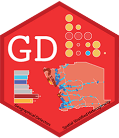

<!-- README.md is generated from README.Rmd. Please edit that file -->

```{r, include = FALSE}
knitr::opts_chunk$set(
  collapse = TRUE,
  comment = "##",
  fig.path = "man/figures/README-",
  out.width = "100%"
)
```

# GD <a href="https://ausgis.github.io/GD/"></a>


<!-- badges: start -->

[](https://CRAN.R-project.org/package=GD)
[](https://CRAN.R-project.org/package=GD)
[](https://CRAN.R-project.org/package=GD)
[](https://ausgis.r-universe.dev/GD)

<!-- badges: end -->

**Geographical Detectors for Assessing Spatial Factors**

## Installation

- Install from [CRAN](https://CRAN.R-project.org/package=GD) with:

``` r
install.packages("GD", dep = TRUE)
```

- Install development binary version from [R-universe](https://ausgis.r-universe.dev/GD) with:

``` r
install.packages("GD",
                 repos = c("https://ausgis.r-universe.dev",
                           "https://cran.rstudio.com/"),
                 dep = TRUE)
```

- Install development source version from [GitHub](https://github.com/ausgis/GD) with:

``` r
# install.packages("devtools")
devtools::install_github("ausgis/GD",
                         build_vignettes = TRUE,
                         dep = TRUE)
```
